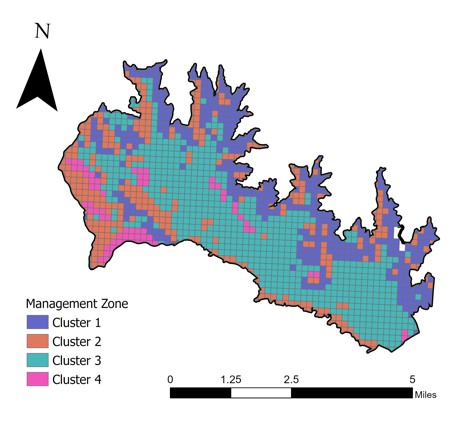
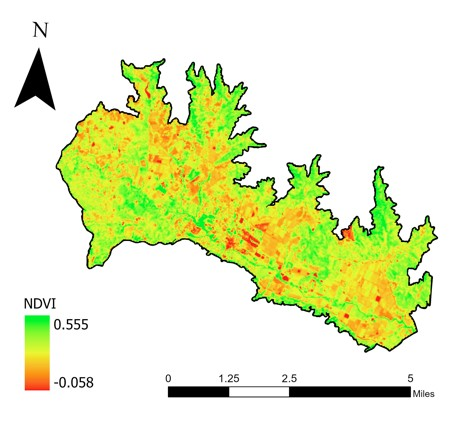
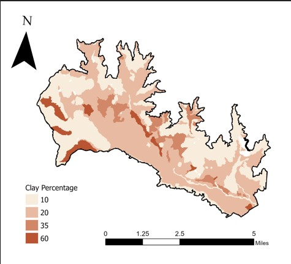
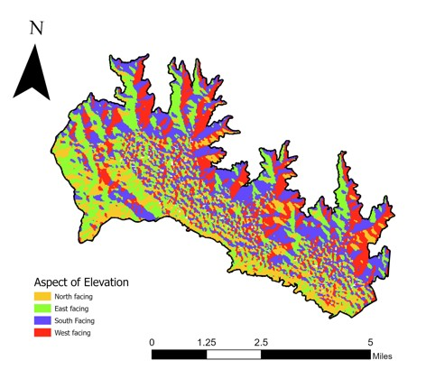
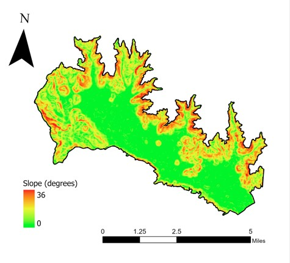

# 🍇 Precision Viticulture: Management Zone Mapping in the Calistoga AVA

## 🗺️ Management Zone Map (Overview)

*A 4-zone K-means clustering map integrating NDVI, slope, clay %, and aspect.*

---

## 📌 Objective  
Identify distinct vineyard management zones in the Calistoga American Viticultural Area (Napa Valley).
Integrate NDVI, soil clay percentage, slope, and aspect into a unified spatial model.
Provide actionable insights to improve irrigation efficiency, canopy management, and drainage planning.

## 🧰 Tools  
GIS / Remote Sensing: ArcGIS Pro · Landsat 8 OLI/TIRS · SRTM DEM
Data Science: R (tidyverse, cluster, factoextra) · K-means clustering · ANOVA
Precision Agriculture: Spatial variability analysis · Management zone delineation

## 🧭 Workflow Summary  
Created a 200m × 200m fishnet grid covering the vineyard region.
Extracted per-cell values for NDVI, clay percentage, slope, and aspect.
Scaled variables in R using scale().
Used the Elbow Method to identify the optimal number of clusters (k = 4).
Ran K-means clustering to delineate management zones.
Performed ANOVA (p < 0.001) to validate NDVI differences between zones.
Mapped and interpreted the final management zones in ArcGIS Pro.

## 📊 Key Results  

Cluster 2 → Highest NDVI; vigorous vines → canopy management recommended
Cluster 3 → Lowest NDVI; flat, clay-heavy soils → drainage improvements needed
Cluster 1 → Steep slopes; moderate NDVI → erosion control + optimized irrigation
Cluster 4 → Balanced slope and soil → stable conditions with moderate interventions

| Cluster | NDVI  | Clay % | Slope (°) | Aspect | Interpretation                                          |
| ------- | ----- | ------ | --------- | ------ | ------------------------------------------------------- |
| **1**   | 0.287 | 14.3   | 16.3      | W-SW   | Steep slopes → focus on erosion + irrigation uniformity |
| **2**   | 0.306 | 13.7   | 14.7      | N-NE   | Strong vigor → prioritize canopy management             |
| **3**   | 0.224 | 20.8   | 3.56      | E-SE   | Low vigor due to clay + low slope → improve drainage    |
| **4**   | 0.261 | 51.6   | 8.55      | N-NE   | Balanced conditions → moderate targeted inputs          |

## 💡 Insights & Recommendations  

Slope and aspect strongly influence vigor, with higher NDVI on well-exposed slopes.
Clay-heavy areas show reduced vigor, indicating drainage limitations and root-zone stress.
High-vigor areas require canopy control to manage vegetative growth and fruit quality.
Management zones enable precision agriculture, reducing input waste and improving vineyard performance.

---
