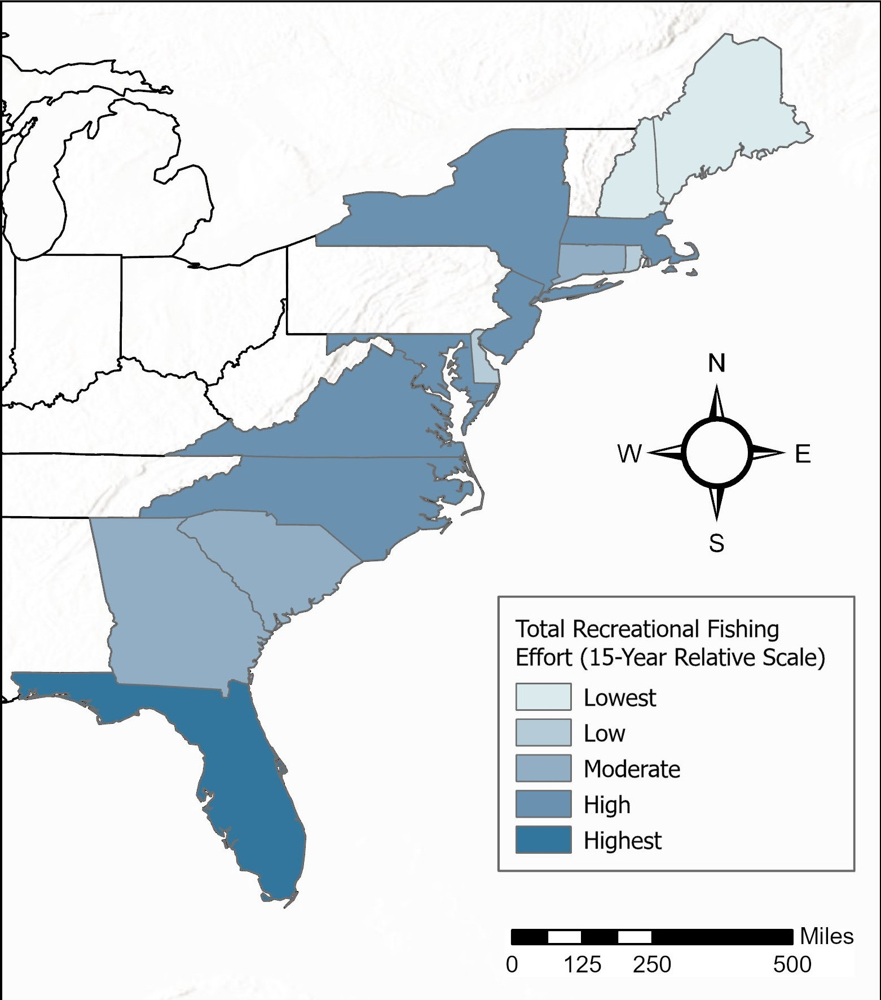

# Fishing Effort Spatial Analytics  
**Understanding Participation, Access, and Behavior Across U.S. Coastal States**

## Project Overview
This project examines recreational fishing activity across U.S. coastal states to better understand the drivers of high fishing effort. Rather than treating fishing activity as a problem to be solved, the analysis takes a diagnostic approach—first mapping total fishing effort and then decomposing that effort through spatial normalization by population, shoreline availability, and fishing mode.

**Key Insight (BLUF):**  
High fishing activity can arise from different underlying drivers. Viewing fishing effort through multiple spatial lenses reveals whether activity is driven primarily by participation intensity, physical access constraints, or behavioral preferences.

---

## Analytical Question
Recreational fishing effort varies widely across coastal states, but total fishing trips alone do not explain why activity is high in certain locations. This analysis asks:

**What factors contribute to high recreational fishing activity, and how does interpretation change when fishing effort is examined relative to population size, shoreline availability, and fishing behavior?**

---

## Approach

### Data
- Recreational fishing trips by state and fishing mode
- State population (year-matched)
- Coastline length by state (proxy for shoreline availability)
- U.S. state boundaries for spatial visualization

### Methods
1. Aggregated fishing trips to the state level to establish total fishing effort.
2. Normalized fishing effort by population (trips per capita) to represent participation intensity.
3. Normalized fishing effort by coastline length (trips per kilometer) to represent access-constrained pressure.
4. Calculated fishing mode shares (%) to provide behavioral context.
5. Visualized spatial patterns using choropleth maps and explored relationships using a supplemental scatterplot.

### Tools
- ArcGIS Pro (data joins, normalization, mapping)
- Spreadsheet analysis for quality control and summary statistics

---

## Results

### 1. Total Fishing Effort (Observed Outcome)
**What this shows:**  
The absolute volume of recreational fishing activity by state.

*Total fishing trips reflect a combined effect of population size, shoreline access, and fishing participation.*

---

### 2. Fishing Effort per Capita (Participation Intensity)
**What this shows:**  
Where fishing participation is disproportionately high relative to population size.

*Per-capita normalization highlights states where fishing represents a more prevalent recreational activity.*

---

### 3. Fishing Effort per Kilometer of Coastline (Access-Constrained Pressure)
**What this shows:**  
Where fishing activity is concentrated along limited shoreline availability.

*Coastline-normalized effort reveals spatial concentration of activity relative to physical access.*

---

### 4. Fishing Mode Context (Behavioral Structure)
**What this shows:**  
How recreational fishing activity is distributed across shore, private boat, and charter modes.

*Fishing mode shares provide context for interpreting participation intensity and shoreline pressure.*

---

### 5. Participation–Access Interaction (Supplemental Analysis)
**What this shows:**  
The relationship between reliance on shore fishing and access-constrained fishing pressure.

*States with higher reliance on shore fishing often exhibit higher fishing effort per kilometer of coastline, suggesting an interaction between access-dependent fishing modes and spatial concentration of activity.*

---

## Interpretation
- Total fishing effort reflects multiple structural drivers and can obscure localized participation and access dynamics.
- Per-capita normalization highlights participation intensity independent of population size.
- Coastline-normalized effort captures how physical access constraints influence spatial concentration of fishing activity.
- Fishing mode share helps explain why similar levels of total effort can imply very different access and pressure dynamics across states.

Together, these perspectives demonstrate that recreational fishing activity is shaped by participation, opportunity, and behavior rather than volume alone.

---

## Limitations & Next Steps
- Coastline length is a proxy for access and does not account for public access points or infrastructure.
- State-level aggregation masks local hotspots and within-state variability.
- Future work could incorporate county-level analysis, access-point datasets, or temporal trends to further refine understanding of fishing pressure.

